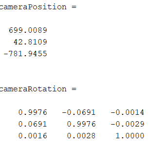
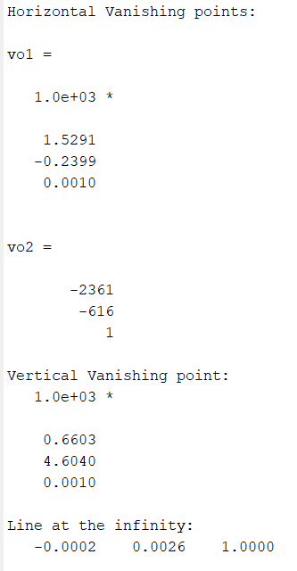
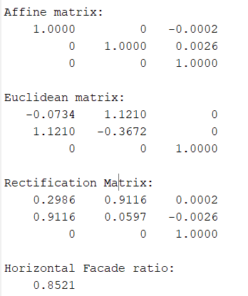
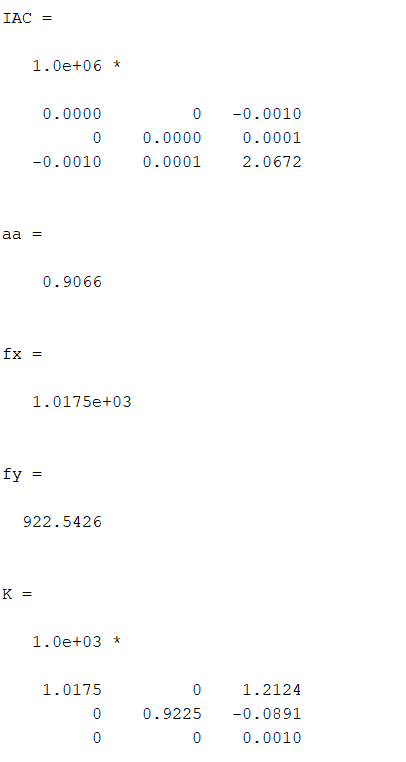

# Visual Motion Analysis of a Musician's Fingers


Tracks a musician's fingers as they play a pipe organ, using only a video from a
fixed camera. The project separates the moving hands from the static keyboard
with a Gaussian Mixture Model background model, cleans the result with
morphological operations, and writes out a masked video. It then uses the
geometry of the scene to calibrate the camera and work out where the camera sits
relative to the keyboard.

Course project for *Image Analysis and Computer Vision* (2022–2023),
Politecnico di Milano, supervised by Prof. V. Caglioti.



## Part 1: Finger extraction

```
Video reading → Foreground detection → Morphological operations → Mask application → New video
```

- **Foreground detection.** `vision.ForegroundDetector` learns a Gaussian
  Mixture Model of the background (the keys) from the first frames. Pixels
  that don't fit the model are marked as moving foreground (the fingers).
- **Morphological clean-up.** An opening with a small disk removes noise, a
  closing with a larger disk joins broken finger regions, and hole filling
  produces a solid mask.
- **Output.** The mask is applied to every frame, hiding the background, and
  two videos are written: the masked footage (`organ/organ_result.avi`) and
  the binary mask alone (`organ/mask_organ.avi`).

## Part 2: Camera calibration and localization

Using a single frame, the camera is calibrated from the scene itself, with no
calibration pattern.

1. **Vanishing points.** Two pairs of parallel lines on the horizontal plane
   give two vanishing points and the line at infinity. A vertical pair gives
   the vertical vanishing point.
2. **Affine rectification.** Mapping the line at infinity back to its canonical
   position restores parallelism.
3. **Metric rectification.** Five manually chosen pairs of orthogonal segments
   constrain the image of the circular points. An SVD solution then recovers
   the scene's true shape up to a similarity, giving the real aspect ratio of
   the horizontal façade.
4. **Calibration.** The image of the absolute conic (IAC) is estimated from the
   orthogonal vanishing points, the line at infinity and the rectifying
   homography, by solving a linear least-squares system. The intrinsic matrix
   **K** (focal lengths, principal point, aspect ratio) is extracted from it.
5. **Vertical façade rectification.** With **K** known, the circular points of
   the vertical plane are found and that plane is rectified too.
6. **Localization.** A homography between the real-world plane and the image,
   combined with **K**, gives the camera's rotation **R** and position
   relative to the scene.

| Vanishing points and horizon | Horizontal rectification | Calibration |
|---|---|---|
|  |  |  |

## Running it

Requires MATLAB with the Computer Vision, Image Processing, Symbolic Math, and
Statistics and Machine Learning toolboxes.

```matlab
main   % runs finger extraction on organ/organ.mp4 and writes the result videos
```

The geometry steps live in their own functions (`hor_rectification`,
`calibration`, `vert_rectification`, `localization`) and can be run on a single
frame.

## Project structure

```
main.m                  # video loop: detection → clean-up → output videos
foregroundDetection.m   # video reader, players, GMM foreground detector
morphOp.m               # opening, closing and hole filling on the mask
displayResults.m        # applies the mask and shows the videos
hor_rectification.m     # vanishing points, affine and metric rectification
IACfunct.m              # estimates the image of the absolute conic
calibration.m           # intrinsic matrix K from the IAC
vert_rectification.m    # rectifies the vertical façade using K
localization.m          # camera rotation and position from the homography
organ/                  # input video, result videos, figures
Visual_motion_analysis_fingers_Kissani.pdf   # presentation
results.pdf                                  # numerical results
```

## Skills demonstrated

Background subtraction with Gaussian Mixture Models, morphological image
processing, projective geometry (vanishing points, line at infinity, circular
points), affine and metric rectification, camera calibration from a single
image, camera pose estimation, MATLAB.
